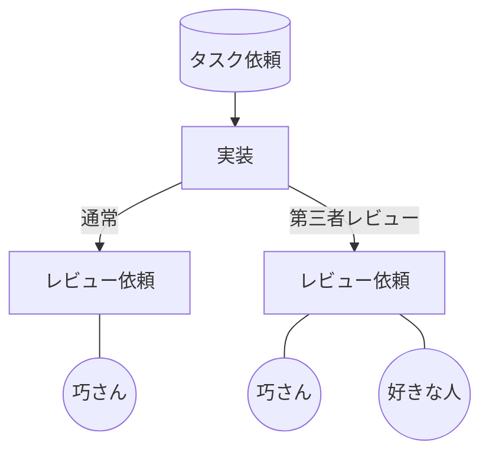
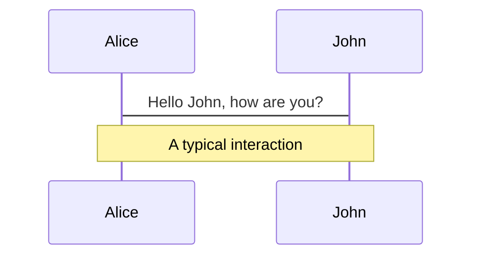
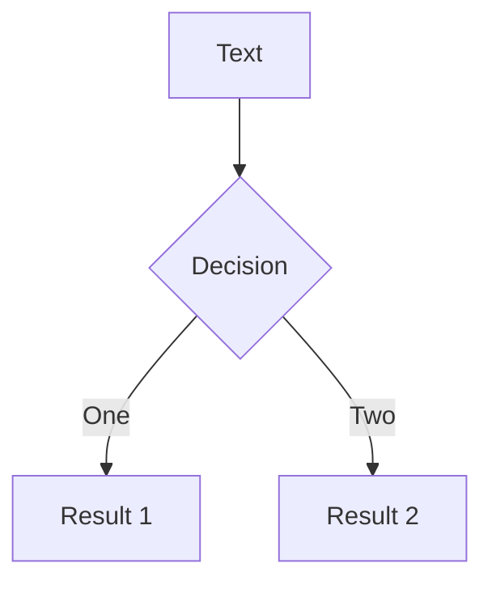
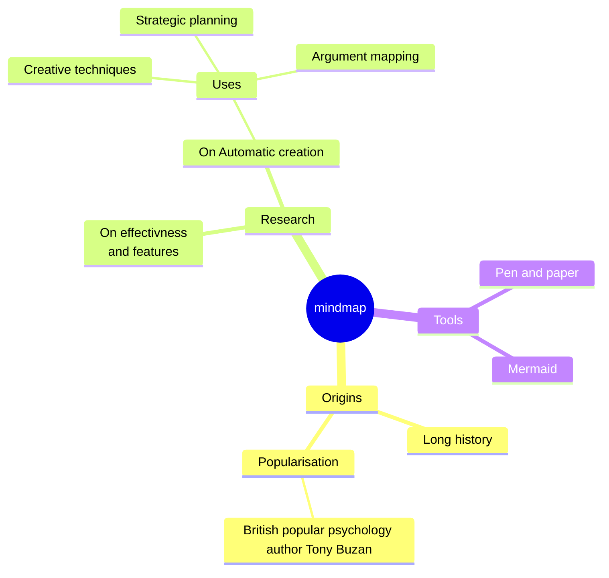
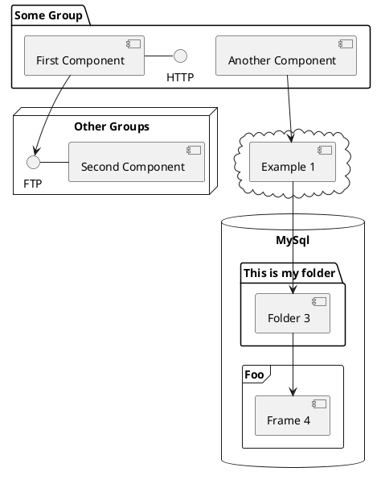

# プロダクト開発FB PJT

Product Development Feedback Project

<div class="pt-12">
  <span @click="$slidev.nav.next" class="px-2 py-1 rounded cursor-pointer" hover="bg-white bg-opacity-10">
    next page <carbon:arrow-right class="inline"/>
  </span>
</div>

<div class="abs-br m-6 flex gap-2">
  <button @click="$slidev.nav.openInEditor()" title="Open in Editor" class="text-xl slidev-icon-btn opacity-50 !border-none !hover:text-white">
    <carbon:edit />
  </button>
  <a href="https://github.com/slidevjs/slidev" target="_blank" alt="GitHub" title="Open in GitHub"
    class="text-xl slidev-icon-btn opacity-50 !border-none !hover:text-white">
    <carbon-logo-github />
  </a>
</div>

<!--
The last comment block of each slide will be treated as slide notes. It will be visible and editable in Presenter Mode along with the slide. [Read more in the docs](https://sli.dev/guide/syntax.html#notes)
-->

---
transition: fade-out
---

# What is FB PJT?
なぜフィードバックプロジェクトを行うのか
***
<br>

- 📝 **目的** - 誰もが互いの成長を願って、**役職・年齢を問わず気軽にフィードバックし合える企業文化**を作りたい<br>
- 🎨 **理由** - EISHINの課題としてフィードバックしにくい環境がある
- 🧑‍💻 **実施する施策** - 第三者サブレビュー
- 🛠 **実施期間** - 11/1~11/30(試験運用)

<br>

<!--
You can have `style` tag in markdown to override the style for the current page.
Learn more: https://sli.dev/guide/syntax#embedded-styles
-->

<style>
h1 {
  background-color: #2B90B6;
  background-image: linear-gradient(45deg, #4EC5D4 10%, #146b8c 20%);
  background-size: 100%;
  -webkit-background-clip: text;
  -moz-background-clip: text;
  -webkit-text-fill-color: transparent;
  -moz-text-fill-color: transparent;
}
</style>

<!--
Here is another comment.
-->

---
layout: default
---

# 目次
***
<Toc maxDepth="1"></Toc>

---
transition: slide-up
level: 2
---

# Navigation

Hover on the bottom-left corner to see the navigation's controls panel, [learn more](https://sli.dev/guide/navigation.html)

## Keyboard Shortcuts

|     |     |
| --- | --- |
| <kbd>right</kbd> / <kbd>space</kbd>| next animation or slide |
| <kbd>left</kbd>  / <kbd>shift</kbd><kbd>space</kbd> | previous animation or slide |
| <kbd>up</kbd> | previous slide |
| <kbd>down</kbd> | next slide |

<!-- https://sli.dev/guide/animations.html#click-animations -->

<p v-after class="absolute bottom-23 left-45 opacity-30 transform -rotate-10">Here!</p>

---
layout: image-right
image: https://source.unsplash.com/collection/94734566/1920x1080
---

# 目的


```ts {0|2-3|1-5|5|all}

フィードバックプロジェクトを行うことで、誰もが互いの成長を願って、
役職・年齢を問わず気軽にフィードバックし合える企業文化を作りたい

実現する新たな仕組みを考え、実行する

```

<br>

# 環境と原因


```ts {0|1|1-2|1-3|all}
・タスク実行者が受け身
・スキル関係がコミュニケーションに影響する
・上司、フィードバック対象の状況がわからず、遠慮する
```

<arrow v-click="[3, 4]" x1="400" y1="320" x2="230" y2="200" color="#564" width="3" arrowSize="1" />

[^1]: [Learn More](https://sli.dev/guide/syntax.html#line-highlighting)

<style>
.footnotes-sep {
  @apply mt-20 opacity-10;
}
.footnotes {
  @apply text-sm opacity-75;
}
.footnote-backref {
  display: none;
}
</style>

---

# 実施する施策

<div grid="~ cols-2 gap-4">
<div>

四半期MTGで3つの施策を考案しました。<br>
その中の**第三者レビュー**を実施します。

```ts {all|2}
理解度スタンプ
第三者レビュー
GitHub Discussions
```

普段のレビューではトップダウンでのレビューが基本。
技術的自信を持っていない人やテキストベースのコミュニケーションが難しいと感じる人にとって、下からのフィードバックがしにくい環境になる。

**第三者レビュー**の導入により、<br>スキルやコミュニケーションのハードルを取り除き<br>気軽にフィードバックを行うことができる環境を作りたい。

参考資料: [開発MTG WS2 プロダクト開発](https://ephemeral-raindrop-ab1faf.netlify.app/7)

</div>
<div>

#### 五十嵐　たくみ

<Tweet id="1677236716758007808" scale="0.65" />

</div>
</div>

<!--
Presenter note with **bold**, *italic*, and ~~striked~~ text.

Also, HTML elements are valid:
<div class="flex w-full">
  <span style="flex-grow: 1;">Left content</span>
  <span>Right content</span>
</div>
-->


---


# 第三者レビュー

<div grid="~ cols-2 gap-4">
<div>

第三者レビューは通常の実装フローのレビュー時に<br>
好きな人を選んでレビュー依頼します。



</div>
<div>

#### 五十嵐　たくみ

<Tweet id="1677236716758007808" scale="0.65" />

</div>
</div>

---
transition: slide-up
---

# ルール

一定の制限を設け、運用継続や適切なレビュアー選択などフィードバックの質を保つことを目的としています。

<div grid="~ cols-2 gap-2" m="-t-2">

```yaml
レビュワー：好きな人
タイミング：好きな時
緊急度：低〜中
```

```yaml
初級: 基本的なタスクや変更。: 文言変更や簡単なコードの修正。
中級: 一般的な経験が必要なタスク。: 新しい機能の実装など（誰か付け加えて、、、）。
上級: 専門知識が必要なタスク。: 仕様理解しなければならないタスクや複雑なコードの修正。
```


</div>

Read more about [How to use a theme](https://sli.dev/themes/use.html) and
check out the [Awesome Themes Gallery](https://sli.dev/themes/gallery.html).

---
preload: false
---

# レビュー依頼方法

第三者レビュー方法について

・レビュワー対象<br>
コミュニケーションが気軽にできる、好きな人、関わったことない人、誰でもOK

・タイミング<br>
タスクの進捗に関わらず、好きな時に依頼できる

・その他追加します

<div class="w-60 relative mt-6">
  <div class="relative w-40 h-40">
    
    
    
  </div>

  <div
    class="text-5xl absolute top-14 left-40 text-[#b2153b] -z-1"
    v-motion
    :initial="{ x: -80, opacity: 0}"
    :enter="{ x: 0, opacity: 1, transition: { delay: 2000, duration: 1000 } }">
    EISHIN
  </div>
</div>

<!-- vue script setup scripts can be directly used in markdown, and will only affects current page -->
<script setup lang="ts">
const final = {
  x: 0,
  y: 0,
  rotate: 0,
  scale: 1,
  transition: {
    type: 'spring',
    damping: 10,
    stiffness: 20,
    mass: 2
  }
}
</script>

<!-- <div
  v-motion
  :initial="{ x:35, y: 40, opacity: 0}"
  :enter="{ y: 0, opacity: 1, transition: { delay: 3500 } }">

[Learn More](https://sli.dev/guide/animations.html#motion)

</div> -->

---

# タスク難易度

レビュー依頼できるタスク難易度

・初級<br>
基本的なタスクや変更。: 文言変更や簡単なコードの修正。

・中級<br>
一般的な経験が必要なタスク。: 新しい機能の実装など（誰か付け加えて、、、）。

・上級<br>
専門知識が必要なタスク。: 仕様理解しなければならないタスクや複雑なコードの修正。

<div class="w-60 relative mt-6">
  <div class="relative w-40 h-40">
    
    
    
  </div>

  <div
    class="text-5xl absolute top-14 left-40 text-[#b2153b] -z-1"
    v-motion
    :initial="{ x: -80, opacity: 0}"
    :enter="{ x: 0, opacity: 1, transition: { delay: 2000, duration: 1000 } }">
    EISHIN
  </div>
</div>

<!-- vue script setup scripts can be directly used in markdown, and will only affects current page -->
<script setup lang="ts">
const final = {
  x: 0,
  y: 0,
  rotate: 0,
  scale: 1,
  transition: {
    type: 'spring',
    damping: 10,
    stiffness: 20,
    mass: 2
  }
}
</script>

---

# Diagrams

You can create diagrams / graphs from textual descriptions, directly in your Markdown.

<div class="grid grid-cols-4 gap-5 pt-4 -mb-6">









</div>

[Learn More](https://sli.dev/guide/syntax.html#diagrams)

---
src: ./pages/multiple-entries.md
hide: false
---

---
layout: center
class: text-center
---

# Learn More

[Documentations](https://sli.dev) · [GitHub](https://github.com/slidevjs/slidev) · [Showcases](https://sli.dev/showcases.html)
